##### These procedure steps will be followed on the simulator

1. When you open Impact Test on Aggregates simulation, a window will open as shown below, click on Description to understand the terminologies, click on NEXT button to proceed. 
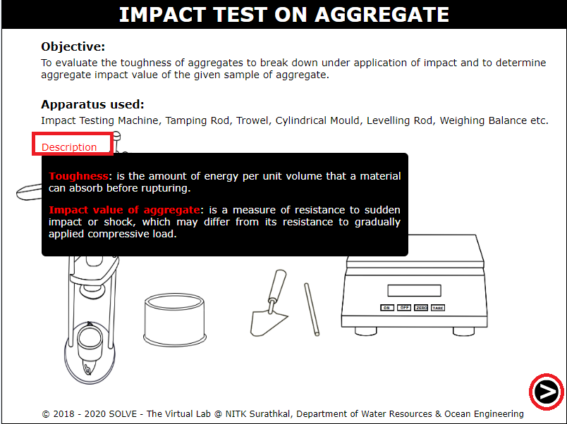 

2. Click on ON button to switch on the weighing machine, then click on the tray to place it in the weighing machine, then click TARE. 
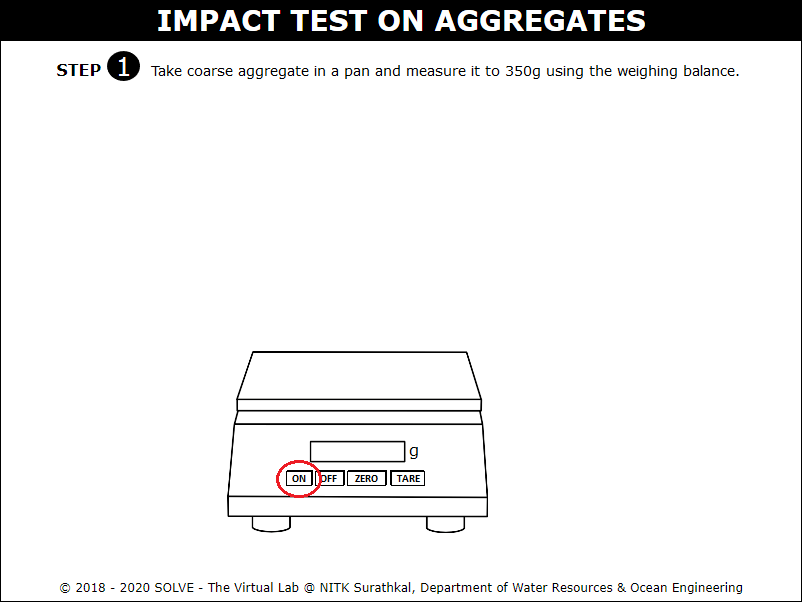 

3. Click on the tray with sample to weigh the required quantity of coarse aggregate. 
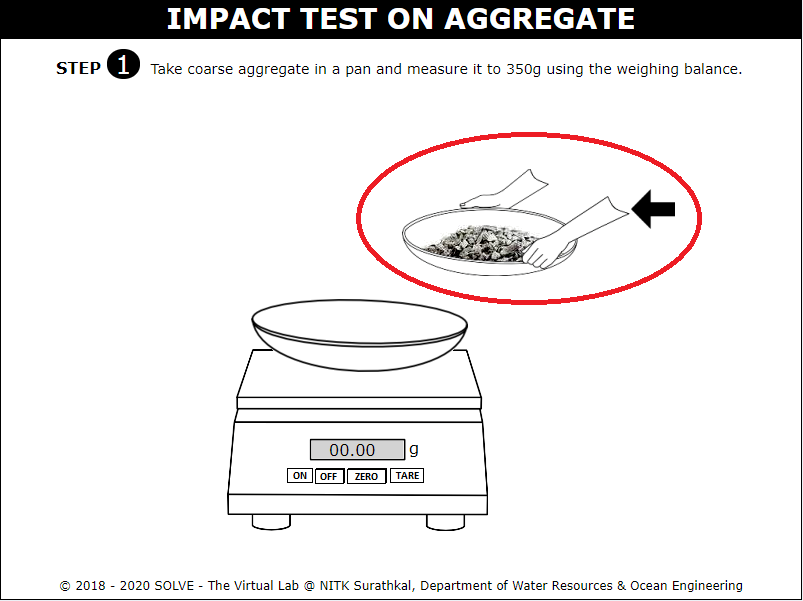 

4. Note down the obtained weight of coarse aggregate, then click on NEXT button to proceed. 
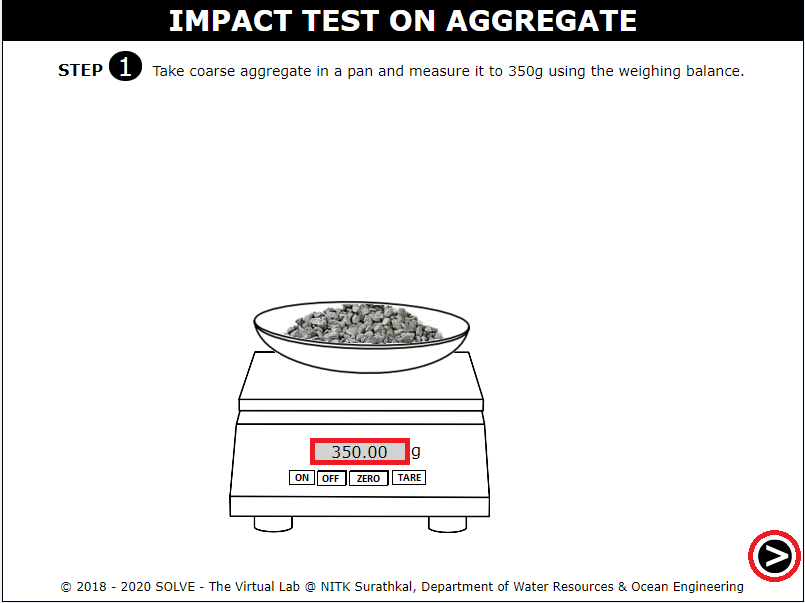 

5. Select the correct answer to proceed to the simulation. 
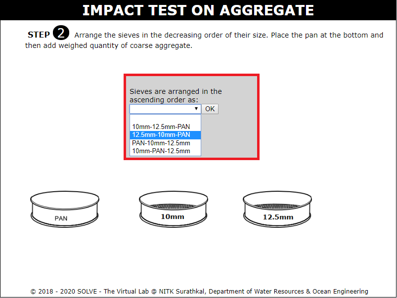 

6. Arrange the sieves in the decreasing order of their size above the pan, click on measured sample to add it to the sieve. 
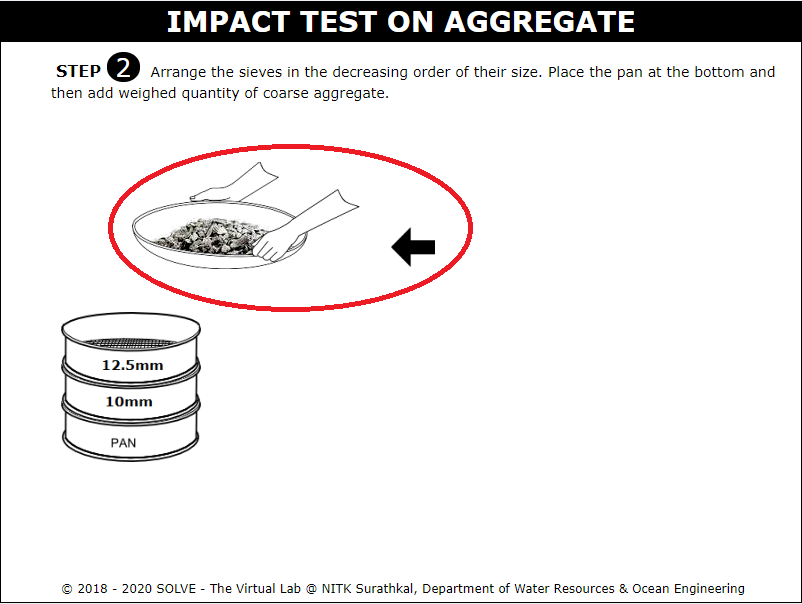 

7. Click on the set of sieves to place it on the mechanical shaker and switch on the machine by clicking on ON button. 
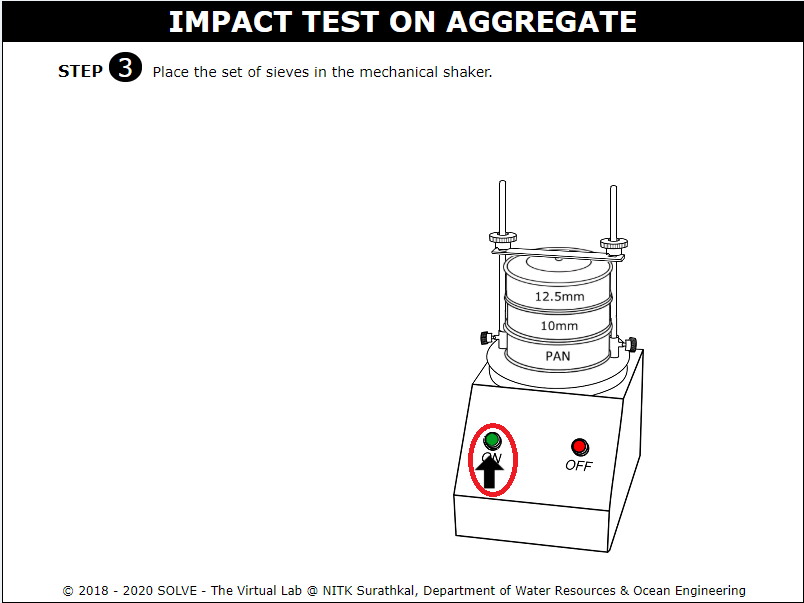 

8. Collect the coarse aggregate retained on 10mm sieve in a separate container. 
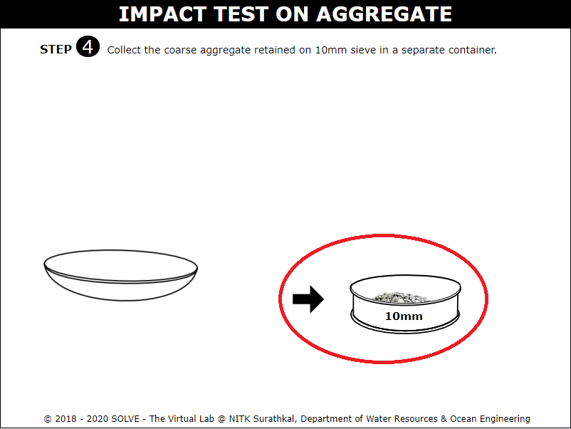 

9.  Note down the weight of the empty cylinder as W1(g). 
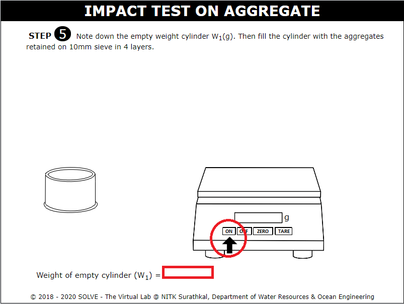 

10. Click on the trowel to fill the cylinder with aggregates in 4 layers. 
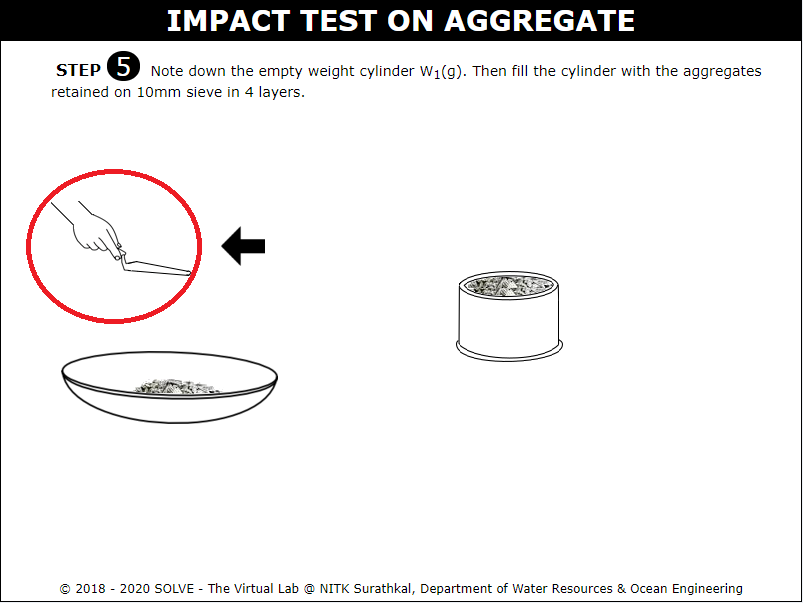 

11. Note down the weight of the cylinder along with aggregates as W2(g), click on NEXT button to proceed. 
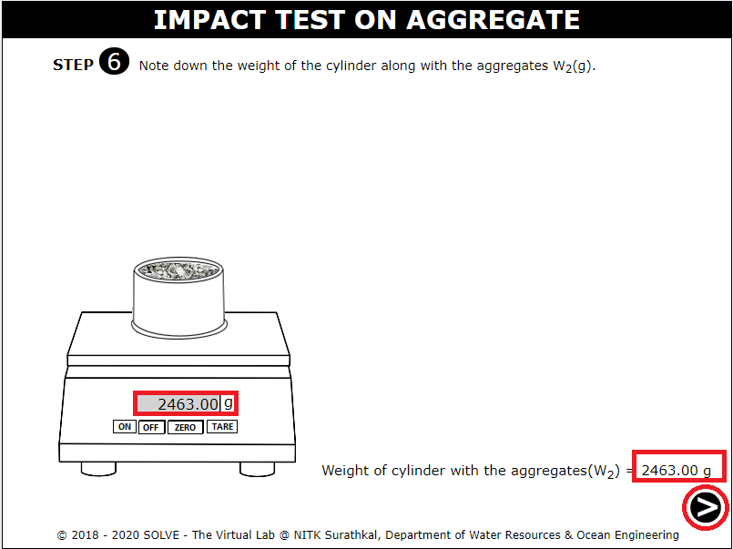 

12. Place the cylinder in the setup by clicking on the cylinder, then click on the screw to remove it. 
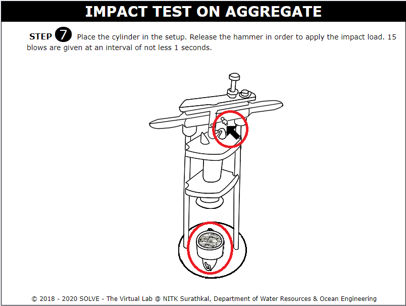 

13. Release the hammer in order to apply the impact load. 15 blows are given at an interval of not less 1 second. 
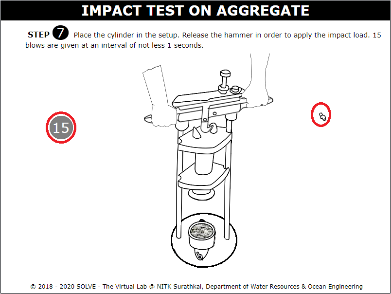 

14. Transfer the aggregates to the to the 2.36mm sieve by clicking on cylinder. Then click on sieve set to place it on the shaker and switch on the machine by clicking on ON button. 
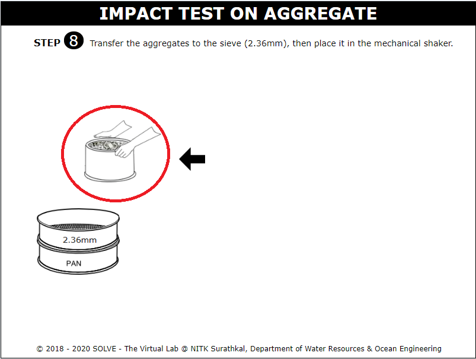 

15.  Note down the weight of the aggregate passing through 2.36mm sieve as W3(g), click on NEXT button to proceed. 
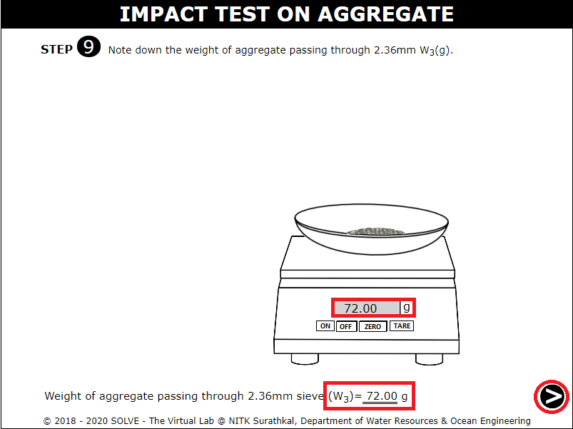 

16. The detailed observation is given here, using the displayed formula calculate the impact test value, click on CHECK button to evaluate the answer. 
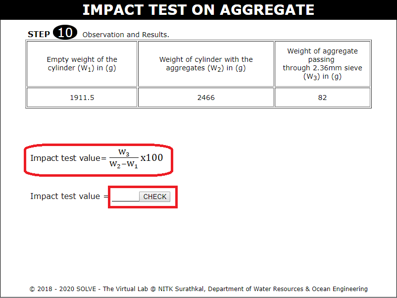 

17. Impact test value is displayed along with the inference obtained from the result. 
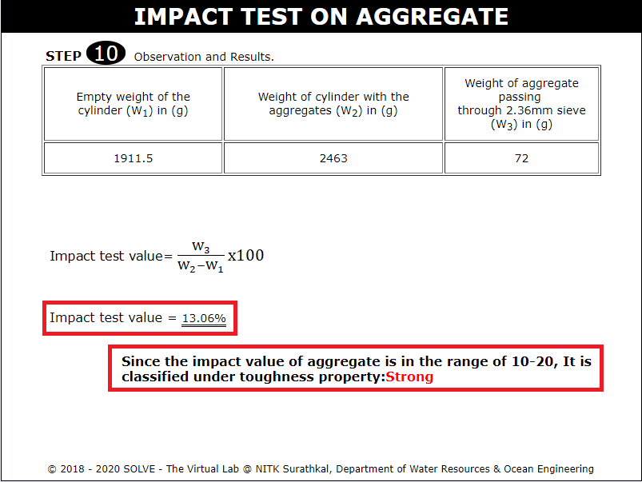 
