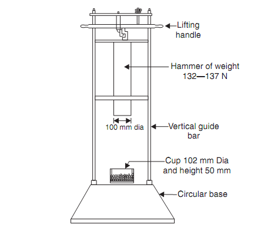
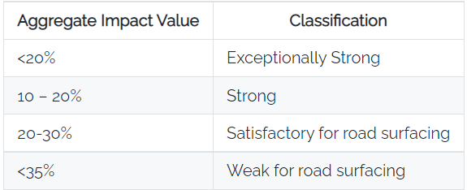
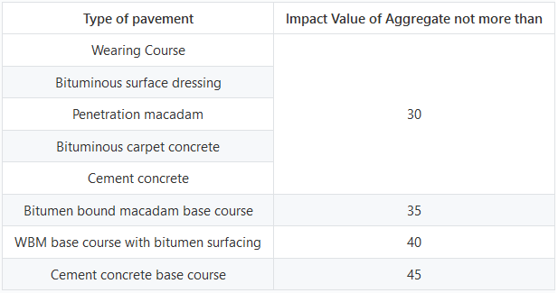

### INTRODUCTION 

Aggregates undergo significant wear and tear throughout their life. Aggregates must be hard and tough enough to resist crushing, degradation and disintegration and be able to transmit loads from the pavement surface to the underlying layers and eventually the subgrade. Testing the strength of parent rock alone does not exactly indicate the strength of aggregates in concrete. For this reason assessment of strength of the aggregates are made by using a sample bulk aggregates in standardized manner.Several tests are thus performed to assess the stability and quality of roads. The Aggregate Impact Value Test is one such test. The impact test is a type of quality control test for highway pavements that is used to determine the suitability of aggregates for use in highway pavement construction. 

The principal mechanical property of aggregate required in any construction is

<ol style="text-indent:50px; text-align:justify;list-style-position: inside">
<li>Satisfactory resistance to crushing under the roller during construction</li>
<li>Adequate resistance to surface abrasion under traffic</li>
</ol>

Aggregates used in road construction should be strong enough to resist abrasion and crushing and also the impact load. If aggregates are weak, then the stability of pavement structure will be adversely affected. The toughness of aggregate is its ability to resist sudden load acting on it. The movement of vehicles on the road sometimes gives rise to impact loading which results in breaking of aggregates into smaller pieces. Therefore the aggregates should have sufficient toughness to resist their disintegration due to impact. This characteristic of aggregate is measured by impact value test.

 

      

  
Aggregate Impact Testing Machine

 

  Source: (<a href="http://www.expertsmind.com/questions/impact-test-tests-on-stones-30118285.aspx">http://www.expertsmind.com/questions/impact-test-tests-on-stones-30118285.aspx</a>)

 

In this test sample of standard aggregates kept in a mould which is subjected to fifteen blows of metal hammer of weight 14 kgs falling from the height of 38cms. The quantity of finer materials resulting from pounding will indicate the toughness of the sample of aggregates. As per IS 283-1970 Aggregates Impact Value is defined as the ratio of weight of fines formed to weight of total sample taken and is expressed in percentage

Aggregates Impact Value gives relative measure of resistance of aggregates to sudden shock or impact, which in some aggregates differs from its resistance to slow compression load. Impact Value should not be less than 45% for aggregates used for concrete other than wearing surface and 30% for concrete used in wearing surface. Table below shows the classification of aggregate with respect to aggregate impact value and limits of aggregate impact value for different types of road construction suggested by Indian Road Congress.

Classification of aggregates based on Aggregate Impact Value

Impact Value of Aggregate for different types of pavement
  

<strong>Relevant Indian Standards</strong>:
  
<ol style="text-indent:25px; text-align:justify;list-style-position: inside">
<li>IS 2386 (Part IV) 1963: Methods of Test for Aggregates Mechanical Properties, Tenth Reprint MARCH 1997.</li>
<li>IS 383-1970: Specification for Coarse and Fine Aggregates.</li>
</ol>
